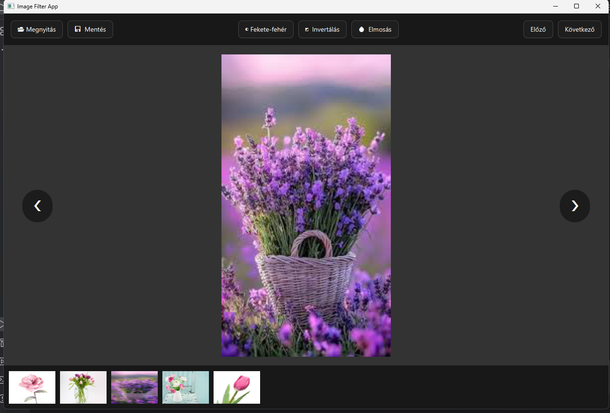

# ImageFilterApp

Ez egy JavaFX alapú desktop alkalmazás, ami lehetővé teszi képek megnyitását, böngészését és egyszerű képfeldolgozó filterek alkalmazását.

Főbb funkciók:
- képek megnyitása és mentése
- előző/ következő kép
- thumbnail alapú képnézegetés
- fekete-fehér filter
- invertálás
- elmosás

Az alkalmazás kinézete az alábbi kéépen látható:

